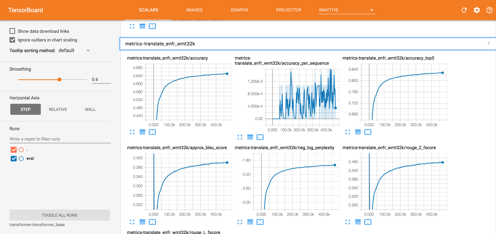

# Offline Translation
Author
- Alexander Wolf

Last Commit Date
- 2/26/18

## Notebook Overview
This [notebook](./offline_translation.ipynb) shows how you can easily train a neural translation model using the [Tensor2Tensor]() API; There will also an additional to show how to use the T2T Library to train any of their models in the API

### Supplied Translation Datasets by Tensor2Tensor
- All of these datasets are for translating to English or from English
- You can add additional datasets to the Tensor2Tensor library, and used their advanced NMT models supplied with the library

1. French
2. German
3. Chinese
4. Chzech
5. Macedonian 

### Translaiton Benchmarks
- Benchmarking good translation models/accuracy is difficult due to the numerous of ways things can be translated
	- The BLEU Score is the most commonly used and practical one
- I was able to Reach a BLEU score of 40 for English-> French and 33 for French-> English which is considered a state of the art performance
- Used the Transformer model from this [research paper by google and model](https://research.googleblog.com/2017/08/transformer-novel-neural-network.html)
	- The Transformer architecture is precoded in the library = o
- Here is a photo of Tensorboard showing the training o an EN -> Fr model that reached a state of the art BLEU score of 40
	- 
- Training/Validation Loss Photo
	- 	

### To Do Still
- Show how to easily see results and decode in notebook
- Tensorboard tutorial for training on DSS gpu
- Detailed README
- Make T2T notebook
