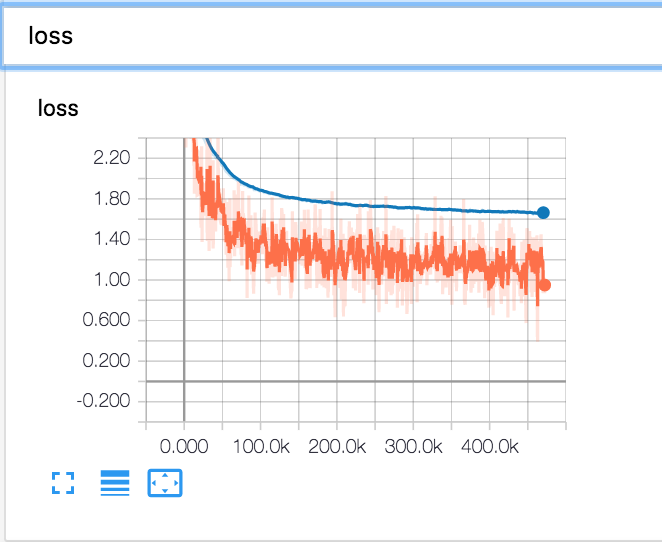

# Offline Translation
Author
- Alexander Wolf

Last Commit Date
- 3/05/18

## Notebook Overview
This documented [notebook](./offline_translation.ipynb) shows how you can easily train a neural translation model using the [Tensor2Tensor](https://github.com/tensorflow/tensor2tensor) API.  

### Supplied Translation Datasets by Tensor2Tensor

All of these datasets are for translating to English or from English by T2T

1. French
2. German
3. Chinese
4. Chzech
5. Macedonian 

### Adding Your Own Datasets
It is possible to add your own translation dataset to Tensor2Tensor and use their models/ easy deep learning framework if they don't supply the language you are translating to. You can view [this link](https://github.com/tensorflow/tensor2tensor/blob/master/docs/new_problem.md) on the Tensor2Tensor API to see how to.

I recommend using Sublime [SFTP extension](https://wbond.net/sublime_packages/sftp) for adding extensions to the library if your running it from a remote server. 


## Tensorboard
T2T is Tensorboard compatible, and logs tons of important metrics for you automatically, including train/eval loss, BLEU Score, and much more. 
- Notes about Tensorboard
	- You need terminal access
	- If running training on a secure server, and you want to view the results on a non-confiured IP address to the server, you can't use local host to ssh in
		- Example proper remote shell for Tensorboard: ```ssh -L 16006:new_ip:6006 user@server_url.com```
		- With this you can access Tensorboard at [127.0.0.1:16006](127.0.0.1:16006) instead of the default localhost:16006
- To use Tensorboard
	1. Activate you python enviroment in the console which contains tensorflow	
		- ``` source PATH_TO_PYENV/bin/activate```
	2. Use Tensorboard on your *train_dir* in T2T, where your model checkpoints are saved 
		- ```tensorboard --logdir PATH_TO_MODEL_train_dir```
	3. Go to [http://host_ip:6006/](http://localhost:6006/) to see your model's training and eval stats


## Measuring Translation Accuracy
- Benchmarking good translation models/accuracy is difficult due to the numerous of ways things can be translated
	- The BLEU Score is the most commonly used and practical one
- Similarly different languages can translate more easily to one another, so you should do your research for what a good BLEU score for the language translation pair is.
- During evaluation T2T uses the approximate BLEU Score, not the real used in research papers since it is computationally expensive to compute
	- T2T supplies a [shell script](https://github.com/tensorflow/tensor2tensor/blob/master/tensor2tensor/bin/t2t-bleu) for getting the real BLEU score
	- EX: ```t2t-bleu --translation=translation.en --reference=ref-translation.de```

### My Results

- I was able to Reach a BLEU score of 40 for English-> French and 33 for French-> English which is considered a state of the art performance
- Used the Transformer model from this [research paper by google and model](https://research.googleblog.com/2017/08/transformer-novel-neural-network.html)
	- The Transformer architecture is precoded into the library
- Here is a photo of Tensorboard showing the training o an EN -> Fr model that reached a state of the art BLEU score of 40
	- 
- Training/Validation Loss Photo
	- 	


### To Do Still
- Show how to decode a translation model for big dataset, and few txt examples
- Make notebook for getting real BLEU score on model

